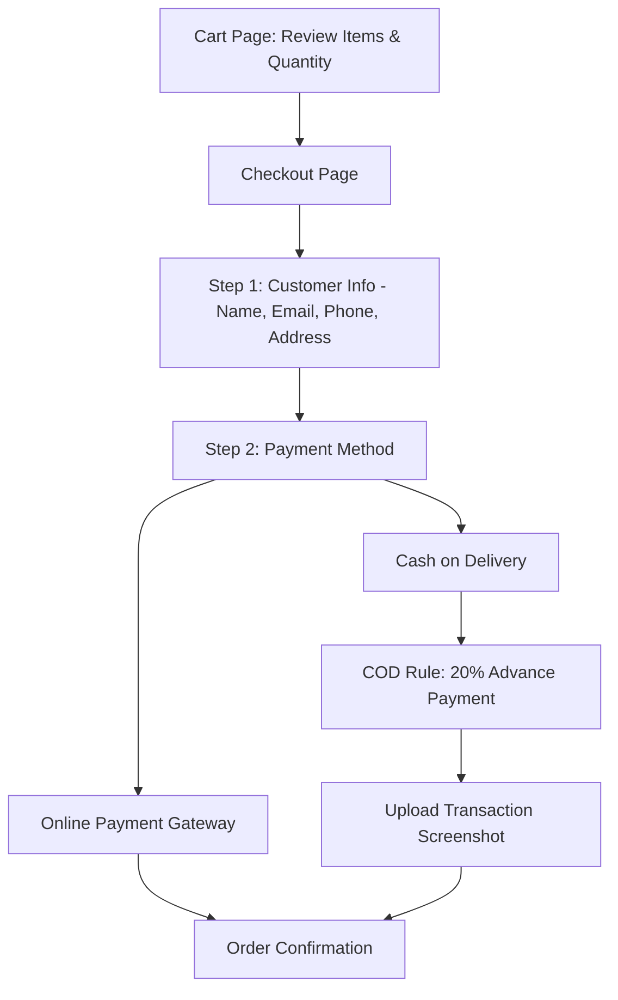
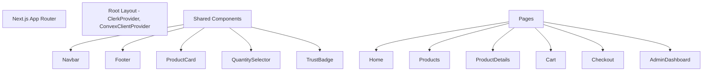

# KishanCo: Agriculture Ecommerce & POS Architecture & Design

## 1. UI Wireframes

### Home Page Structure
```mermaid
graph TD
  Nav[Navbar: Logo, Links, Login/Signup - Sticky & Glassmorphism]
  Hero[Hero Section: Wheat Field Imagery, "Pure Seeds. Better Harvests.", CTAs]
  Trust[Trust Cards: Pure Seeds | Affordable | Packaging | Delivery]
  Products[Featured Products: Wheat, Mustard, Soyabean]
  Process[Process Timeline: Selection -> Testing -> Packaging -> Delivery]
  CTA[Bottom CTA: "Create your account and order today"]
  Footer[Footer: Quick Links, Contact Info, Socials]
  Nav --> Hero --> Trust --> Products --> Process --> CTA --> Footer
```

### Checkout Flow


## 2. Full UX Structure
**Target Audience:** Farmers, small retailers, rural customers, non-technical users.
**Core Principles:**
- **Zero Friction:** One-click Add to Cart, clear prominent checkout buttons.
- **Trust Building:** Permanent visibility of trust badges and easy access to contact information.
- **Clear Constraints:** Minimum order quantities (5 KG) clearly communicated *before* checkout.

## 3. Component Architecture


## 4. Design System
- **Colors:**
  - Primary: Harvest Gold (`#D9A441`), Deep Terracotta (`#A63D2F`)
  - Backgrounds: Warm Ivory (`#F8F5EE`), Soft Cream (`#F3EEDF`)
  - Text: Rich Charcoal (`#222222`), Warm Gray (`#5F5B53`)
- **Typography:**
  - Headings: **Poppins** (Bold, spacious)
  - Body: **Inter** (Highly readable, simple)
- **UI Feel:** Minimalist, rounded cards (24px radius), soft shadows (`0 10px 40px rgba(0,0,0,0.04)`), elegant thin borders (`#DDD3C3`).

## 5. Tailwind Structure
`tailwind.config.ts` configuration approach:
```javascript
theme: {
  extend: {
    colors: {
      brand: {
        yellow: '#D9A441',
        red: '#A63D2F',
        redHover: '#8B3125',
      },
      surface: {
        ivory: '#F8F5EE',
        cream: '#F3EEDF',
      },
      text: {
        charcoal: '#222222',
        gray: '#5F5B53',
      },
      border: {
        sand: '#DDD3C3',
      }
    },
    fontFamily: {
      sans: ['var(--font-inter)'],
      heading: ['var(--font-poppins)'],
    },
    boxShadow: {
      soft: '0 10px 40px rgba(0,0,0,0.04)',
      btn: '0 8px 24px rgba(166,61,47,0.18)',
    }
  }
}
```

## 6. Page Hierarchy
- `/` - Home Page
- `/products` - Product Listing
- `/products/[slug]` - Product Detail Page
- `/cart` - Shopping Cart
- `/checkout` - Multi-step Checkout
- `/about` - About Us & Contact
- `/admin` - Admin Dashboard (Protected Route)

## 7. Sanity CMS Schema Ideas
**Product Document (`product.ts`):**
- `title` (String)
- `slug` (Slug)
- `description` (Text/PortableText)
- `price` (Number - in INR)
- `images` (Array of Images)
- `stockStatus` (String: In Stock, Out of Stock)
- `category` (Reference to Category)
- `seedQuality` (String)
- `packagingDetails` (String)
- `farmingRecommendations` (Text)
- `minOrderQuantity` (Number, default 5)

## 8. Responsive Layouts
- **Mobile First:** Hamburger navigation, full-width buttons, stacked single-column grids for products and checkout steps.
- **Tablet:** 2-column grids for products, side-by-side cart and summary.
- **Desktop:** Sticky navbar with full links, 3-column product grids, sticky cart summary on the right side of the checkout page. Large immersive hero sections.

## 9. Dashboard UI
Using `shadcn/ui` data tables and cards:
- **Overview Tab:** Revenue, total orders, pending COD validations.
- **Orders Tab:** Table listing orders with Status (Pending, Paid, Shipped, Delivered), and a column for "Payment Proof" (clickable modal to view uploaded QR screenshot).
- **Products Tab:** Quick edit integration with Sanity or direct links to Sanity Studio.

## 10. Checkout UX Flow
1. **Cart Review:** User reviews 5kg minimum rule. Clicks "Proceed".
2. **Auth Gate:** Clerk triggers login/signup if guest.
3. **Shipping:** Single clean form for Address & Phone.
4. **Payment Selection:**
   - Online Payment -> Redirect to Gateway.
   - COD -> Shows "20% Advance Requirement". Displays Bank Details/QR -> Shows Image Uploader for proof -> Submit Order.
5. **Success Page:** Clear order ID and next steps.

## 11. Animation Recommendations (Framer Motion)
- **Hero Text:** Staggered `opacity: 0, y: 20` to `opacity: 1, y: 0`.
- **Product Cards:** `whileHover={{ y: -4, boxShadow: "..." }}`.
- **Process Timeline:** SVG dashed line drawing animation using `pathLength`.
- **Page Transitions:** Soft cross-fade (duration 0.3s).
- **Avoid:** Bouncy effects, heavy parallax, spinning icons.

## 12. Production-Ready UI Direction
- **Images:** Strict use of high-quality `.webp` photography (wheat closeups, seed packaging, farmer hands). No cartoons.
- **Icons:** `lucide-react` with `strokeWidth={1.5}`.
- **Performance:** Server Components for product listings, Client Components only for interactivity (Cart, Quantity).
- **Backend Sync:** Use Convex to sync real-time order status and Clerk for seamless user identity across the app and Sanity CMS.